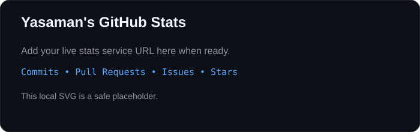
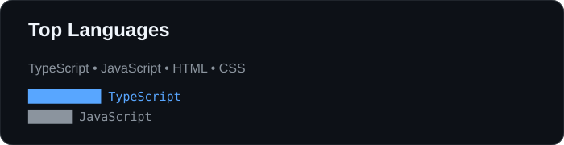
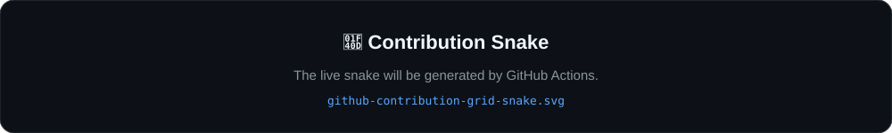
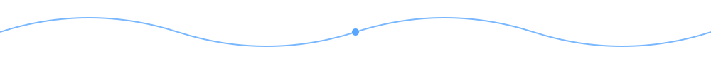

# 👋 Hi, I'm Yasaman Safarian

### Front-End Developer | Angular | TypeScript | JavaScript

 

<a href="https://www.linkedin.com/in/yasamansafarian">LinkedIn</a>
&nbsp;•&nbsp;
<a href="https://github.com/YasamanSafarian">GitHub</a>

---

## 🚀 About Me

💻 **Front-End Developer** focused on building modern web applications  
⚡ Experienced with **Angular, TypeScript and JavaScript**  
🎨 Interested in **Figma & UI implementation**  
🌐 Passionate about **responsive web interfaces**  
🎓 **Computer Engineering Student at Bu-Ali Sina University**  
🌱 Continuously improving my frontend development skills

---

## 🧰 Tech Stack

### Frontend

  
  
  
  
  
  
  

### Tools & Design

  
  
  
  
  

---

## 📌 Featured Projects

| Project | Description | Stack |
|---|---|---|
| 🌞 **Raahbar Solar Monitoring Dashboard** | Frontend dashboard for monitoring and visualizing solar energy data. | Angular · TypeScript |
| 🎫 **Eventic** | Event-management web application with a modern UI. | Next.js · Tailwind CSS · Go |
| 🛒 **Pcaz** | E-commerce web application with frontend and backend components. | Go · Node.js · MySQL |
| 🐦 **Twitterak** | Mini social-media application inspired by Twitter. | JavaScript |

---

## 📊 GitHub Statistics

  
    
  

---

## 🐍 Contribution Activity

  

---

## 🌱 Currently Learning

`Angular` · `Advanced TypeScript` · `RxJS` · `NestJS` · `Backend Development`

---

## 🎯 What I Care About

- ✨ Clean and maintainable code
- 📱 Responsive UI
- 🎨 Pixel-perfect UI implementation
- ⚡ Performance
- 🧩 Reusable components
- 📚 Continuous learning

---

### 💙 Thanks for visiting my profile!

