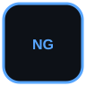
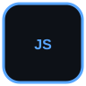
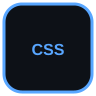
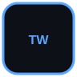
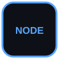
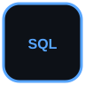
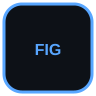
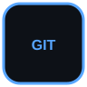
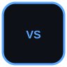
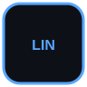

<div align="center">

# 👋 Hi, I'm Yasaman Safarian

### Front-End Developer | Angular | TypeScript | JavaScript


<br />

<a href="YOUR_LINKEDIN_URL">
  
</a>
&nbsp;
<a href="https://github.com/YasamanSafarian">
  
</a>

</div>

---

## 🚀 About Me

💻 **Front-End Developer** focused on building modern web applications

⚡ Experienced with **Angular, TypeScript and JavaScript**

🎨 Interested in **UI implementation and translating Figma designs into responsive interfaces**

🌐 Passionate about building **clean, responsive and user-focused web experiences**

🎓 **Computer Engineering Student at Bu-Ali Sina University**

🌱 Continuously learning and improving my frontend development skills

---

## 🧰 Tech Stack

### 💻 Frontend

<p>
  
  
  
  
  
  
  
</p>

### ⚙️ Backend

<p>
  
  
</p>

### 🗄️ Database

<p>
  
  
</p>

### 🛠️ Tools & Design

<p>
  
  
  
  
  
</p>

---

## 📌 Featured Projects

<table>
<tr>

<td width="50%">

### 🌞 Raahbar Solar Monitoring Dashboard

A frontend dashboard for monitoring and visualizing solar energy data through a modern and responsive interface.

**Tech Stack**

`Angular` `TypeScript`

</td>

<td width="50%">

### 🎫 Eventic

A web application focused on event management with a modern user interface and responsive design.

**Tech Stack**

`Next.js` `Tailwind CSS` `Go`

</td>

</tr>

<tr>

<td width="50%">

### 🛒 Pcaz

An e-commerce web application with both frontend and backend components.

**Tech Stack**

`Go` `Node.js` `MySQL`

</td>

<td width="50%">

### 🐦 Twitterak

A mini social media application inspired by Twitter.

**Tech Stack**

`JavaScript` `Frontend Development`

</td>

</tr>
</table>

---

## 📊 GitHub Statistics

<div align="center">


<br />


</div>

---

## 🐍 Contribution Activity

<div align="center">


</div>

---

## 🌱 Currently Learning

```text
Angular
   ↓
Advanced TypeScript
   ↓
RxJS & Reactive Programming
   ↓
NestJS & Backend Development
   ↓
System Design
```

---

## 🎯 What I Care About

* ✨ Clean and maintainable code
* 📱 Responsive UI
* 🎨 Pixel-perfect UI implementation
* ⚡ Performance
* 🧩 Reusable components
* 🔐 Scalable application architecture
* 📚 Continuous learning

---

## 📫 Let's Connect

<div align="center">

<a href="https://www.linkedin.com/in/yasamansafarian">
  LinkedIn
</a>

  •  

<a href="https://github.com/YasamanSafarian">
  GitHub
</a>

</div>

<br />

<div align="center">

### 💙 Thanks for visiting my profile!


</div>
